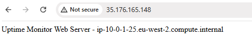
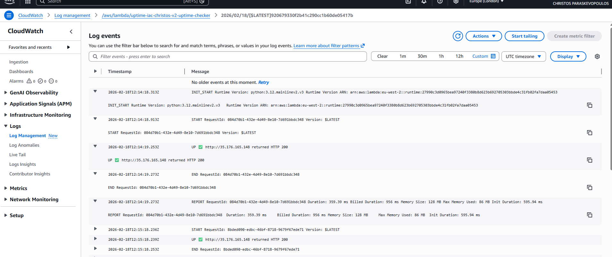
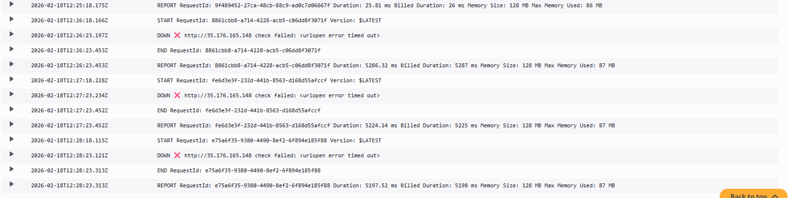
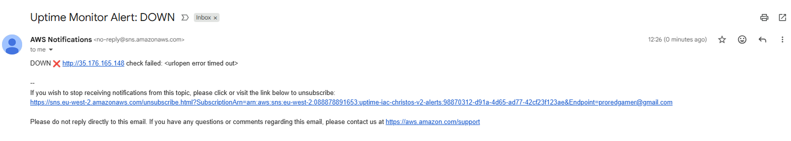
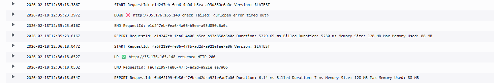

# aws-uptime-monitor-iac

Production-style AWS uptime monitor built with Terraform (IaC).  
It provisions a web target (EC2 + Elastic IP) and an automated monitoring pipeline (Lambda + EventBridge + SNS) with CloudWatch logs and remote Terraform state.

## Architecture

- Custom VPC (public subnet)
- EC2 (Apache) + Elastic IP
- Lambda uptime checker (Python)
- EventBridge schedule (rate: 1 minute)
- SNS email alerts
- CloudWatch logs
- Terraform remote backend (S3 + DynamoDB locking)

## Project structure

```
bootstrap/   # S3 backend + DynamoDB locking
infra/       # VPC, EC2, EIP, SNS, Lambda, EventBridge
docs/        # screenshots used in this README
```

The `bootstrap/` folder creates the S3 bucket and DynamoDB table that Terraform uses to store its state file remotely. This means multiple people (or CI/CD pipelines) can work on the same infrastructure without overwriting each other's changes. The DynamoDB table handles locking so two `terraform apply` commands can't run at the same time and corrupt the state.

The `infra/` folder contains the actual monitoring stack — the VPC, EC2 instance, Lambda function, and everything else that makes the uptime monitor work.

## Demo evidence

### Web target online


### Lambda check working (CloudWatch logs)


### Scheduled execution every minute


### Outage detected + email alert



### Recovery detected


## Deploy

### 1) Bootstrap remote state

```bash
cd bootstrap
terraform init
terraform apply -var="name_prefix=uptime-iac-yourname"
```

This step only needs to run once. It creates the S3 bucket and DynamoDB table where Terraform will store its state. Once this exists, you can safely run `terraform apply` from anywhere (or from CI/CD) without worrying about conflicts.

### 2) Deploy infrastructure + monitoring

```bash
cd ../infra
terraform init
terraform apply \
  -var="name_prefix=uptime-iac-yourname" \
  -var="alert_email=you@example.com" \
  -var="check_url=http://<ELASTIC_IP>"
```

**Note:** You'll need to run this in two passes. The first `apply` creates the EC2 instance and Elastic IP. Grab the IP from the output, then run `apply` again with the full `check_url` so the Lambda function knows what to monitor.

## Destroy

```bash
cd infra
terraform destroy \
  -var="name_prefix=uptime-iac-yourname" \
  -var="alert_email=you@example.com" \
  -var="check_url=http://<ELASTIC_IP>"
```

## Notes

- Region: `eu-west-2`
- Terraform: `1.14.x`
